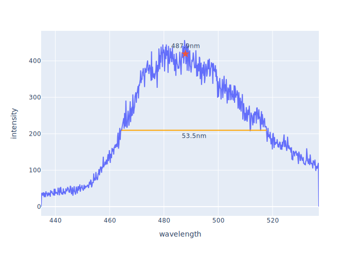
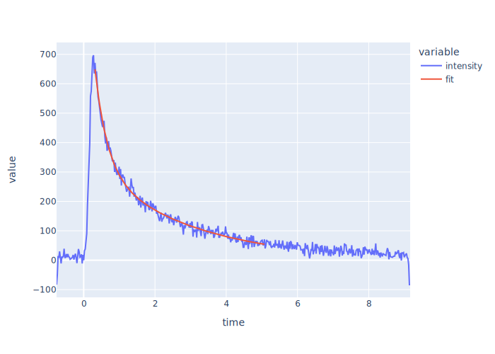

# Data Analysis Package for Takeuchi Lab <!-- omit in toc -->

<p align="center">
<a href="https://github.com/wasedatakeuchilab/tlab-analysis/actions?query=workflow%3ATest" target="_blank">
    
</a>
<a href="https://codecov.io/gh/wasedatakeuchilab/tlab-analysis" target="_blank">
    
</a>
</p>

**_tlab-analysis_** is a Python package for data analysis in Takeuchi laboratory.

- [Installation](#installation)
- [Getting started](#getting-started)
  - [TRPL measurement](#trpl-measurement)
    - [Load data](#load-data)
    - [Show streak image](#show-streak-image)
    - [H-figure](#h-figure)
    - [V-figure](#v-figure)
- [License](#license)

## Installation

```console
pip install git+https://github.com/wasedatakeuchilab/tlab-analysis
```

## Getting started

### TRPL measurement

#### Load data

```python
import tlab_analysis import trpl

# Load data from a raw file generated by u8167
filename = "data.img"
data = trpl.read_file(filename)

# Load data from buffer of a raw file
with open(filename, "rb") as f:
    data = trpl.read_file(f)
```

#### Show streak image

```python
import plotly.express as px

fig = px.imshow(data.to_streak_image())
fig.show()
```


You can also see it as a 3D surface plot.

```python
import plotly.graph_objects as go

fig = go.Figure(
    go.Surface(
        x=data.wavelength.unique(),
        y=data.time.unique(),
        z=data.to_streak_image(),
    )
)
fig.show()
```


#### H-figure

```python
from tlab_analysis import utils

wdf = data.aggregate_along_time()
fig = px.line(wdf, x="wavelength", y="intensity")
fig.show()
```


Find the peaks and their FWHMs.

```python
peaks = utils.find_peaks(wdf["wavelength"], wdf["intensity"])
fig.add_scatter(
    x=list(map(lambda p: p.x, peaks)),
    y=list(map(lambda p: p.y, peaks)),
    mode="markers+text",
    text=list(map(lambda p: f"{p.x:.1f}nm", peaks)),
    textposition="top center",
    marker=go.scatter.Marker(size=12, symbol="star"),
    showlegend=False,
)
for peak in peaks:
    fig.add_shape(
        type="line",
        label=go.layout.shape.Label(text=f"{peak.width:.1f}nm", yanchor="top"),
        x0=peak.x0,
        x1=peak.x1,
        y0=peak.y0,
        y1=peak.y0,
        showlegend=False,
        line_color="orange",
    )
fig.show()
```


#### V-figure

```python
tdf = data.aggregate_along_wavelength(wavelength_range=(470, 510))
fig = px.line(tdf, x="time", y="intensity")
fig.show()
```


Fit a double exponential function to the data to estimate its relaxation times.

```python
import numpy as np


def double_exponential(t, a, tau1, b, tau2):
    return a * np.exp(-t / tau1) + b * np.exp(-t / tau2)


decay_range = utils.find_decay_range(tdf["intensity"])
params, _ = utils.curve_fit(
    double_exponential,
    tdf["time"][decay_range[0] : decay_range[1]],
    tdf["intensity"][decay_range[0] : decay_range[1]],
    bounds=(0.0, np.inf),
)
tdf["fit"] = double_exponential(time[decay_range[0] : decay_range[1]], *params)
fig = px.line(tdf, x="time", y=["intensity", "fit"])
fig.show()
print(params)
```



## License

[MIT License](./LICENSE)

Copyright (c) 2022 Shuhei Nitta
