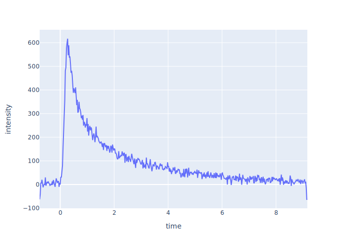

# A Data Analysis Package for Takeuchi Lab  <!-- omit in toc -->
<p align="center">
<a href="https://github.com/Waseda-TakeuchiLab/tlab-analysis/actions?query=workflow%3ATest" target="_blank">
    
</a>
<a href="https://codecov.io/gh/Waseda-TakeuchiLab/tlab-analysis" target="_blank">
    
</a>
</p>

***tlab-analysis*** is a Python package for data analysis in Takeuchi laboratory.

- [Installation](#installation)
- [Getting Started](#getting-started)
  - [Photo Luminescence Experiments](#photo-luminescence-experiments)
    - [Load Data](#load-data)
    - [Show Streak Image](#show-streak-image)
    - [H-Figure](#h-figure)
    - [V-Figure](#v-figure)
- [License](#license)


## Installation
```sh
$ pip install git+https://github.com/Waseda-TakeuchiLab/tlab-analysis
```


## Getting Started

### Photo Luminescence Experiments

#### Load Data
```python
import tlab_analysis.photo_luminescence as pl

# Load data from a raw file generated by u8167
filename = "data.img"
data = pl.read_img(filename)

# Load data from buffer of a raw file
with open(filename, "rb") as f:
    data = pl.read_img(f)
```

#### Show Streak Image
```python
import plotly.express as px

fig = px.imshow(data.streak_image)
fig.show()
```


You can also see it as a 3D surface plot.
```python
import plotly.graph_objects as go

fig = go.Figure(
    go.Surface(
        x=data.wavelength,
        y=data.time,
        z=data.streak_image
    )
)
fig.show()
```


#### H-Figure
```python
tr = data.resolve_along_time()
fig = px.line(tr.df, x="wavelength", y="intensity")
fig.add_vline(tr.peak_wavelength)
fig.show()
```


Get its properties.

```python
peak_wavelength = tr.peak_wavelength
peak_intensity = tr.peak_intensity
FWHM = tr.FWHM
```


#### V-Figure
```python
wr = data.resolve_along_wavelength(
    wavelength_range=(470, 500)
)
fig = px.line(wr.df, x="time", y="intensity")
fig.show()
```



Fit double exponential function to estimate relaxation times.
```python
import numpy as np

def double_exponential(t, a, tau1, b, tau2):
    return a * np.exp(-t/tau1) + b * np.exp(-t/tau2)

params, cov = wr.fit(double_exponential)
fig = px.line(wr.df, x="time", y=["intensity", "fit"])
fig.show()
```


## License
[MIT License](./LICENSE)

Copyright (c) 2022 Shuhei Nitta
